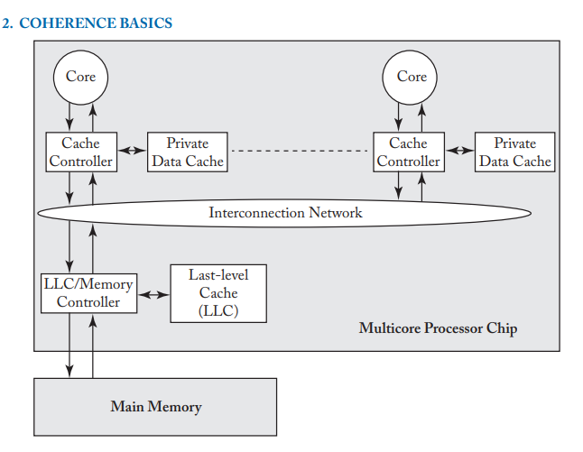

``# Chapter 1
## Memory consistency
Memory consistency is a precise spec that defines shared memory correctness. 
The authors talk about consistency models as how loads and stores (reads and writes) interact on shared memory. They then emphasize the difficulty of defining memory consistency, in terms of shared memory correctness, because of the nature of shared memory. It does this by comparing shared memory to a single processor core.
They emphasize that a single processor given a valid output will produce either a single well-defined output because there's no concurrency even on an out-of-order core(basically CPU reorderings). Though for shared memory, due to loads/stores operation concurrently there's a possibility of multiple correct and many more incorrect executions. Therefore, the multitude of correct executions/interleaving makes it hard to prove if a certain execution is correct or not.

The burden of implementing the desired consistency level falls to the hardware level. 

### Coherence
The authors describe incoherence, rather than coherence, as a processor's cache being out of date when another processor modifies it's cache. The authors then emphasize that the goal of cache coherence in shared memory systems, is to make them functionally invisible(i.e. you never have to think about if a cache at any point in time is valid/invalid). Multicore systems maintain coherence through a coherence protocol. 

A memory consistency model determines if a read (by a reader process/threads) of a write (by a writer process/thread is valid), even if the writer process/thread executed the writes in the correct order. In short, it determines, if that behaviour is correct or incorrect

# Chapter 2
## Cache coherence

### A baseline system model
In a multiprocessor chip. The processor consists of multiple sequential cores. Each core contains its own **private data cache**(which is *writeback*) and a shared LLC(last level cache) which is shared by all cores. All private caches and the LLC communicate through their cache controllers, over a shared interconnection network
> The LLC is positioned near the main memory mainly to reduce the avg latency of memory accesses and increase the memory's overall bandwidth. The LLC also acts as an on chip memory controller

All communication between caches is facilitated by the cache controller, as for the LLC its facilitated by the memory controller.

### The problem of coherence
The problem of coherence occurs when multiple actors(cores) act upon shared memory / caches(loads and stores to caches). For example given two cores **A** and **B** with reading from a memory addr with value 42. Core **A** updates the value at that mem addr from 42 to 43, while Core **B** spins on the value 42, waiting for it to change, but it never does, so B spins indefinitely, Core **B** never saw the value of the write from Core **A**, hence why it spins indefinitely. This is a problem of coherence.
Recall from the **baseline system model** when we laid out the basic architecture of a multicore system, all cores have a writeback cache. A writeback cache, data is written to the cache only and not propagated to main memory until the cache is evicted/flushed. Hence, given this context, it makes sense why Core **B** never saw the write by Core **A** to the memory addr. However, this issue is solved through coherence protocols.

**NOTE:** Actors, in some sense, sometimes are not processor cores.

## Coherence Protocols
A coherence protocol, ensures that writes from a core are made visible to other cores.

All processor cores interact with a coherence protocol through an abstract interface that exposes two methods:

| Method        | Params                                   | Returns                    |
|---------------|------------------------------------------|----------------------------|
| Read Request  | The memory location                      | The value at that location |
| Write Request | The memory location, Value to be written | An acknowledgement         |

Coherence protocols can be divided into two categories
1. **Consistency-agnostic coherence:** Writes are propagated(made visible) synchronously to all caches/cores before returning, giving an illusion of an atomic memory system(basically, the write happened, or it didn't)
2. **Consistency-directed coherence:** Writes are propagated asynchronously, meaning a write can return before it is made visible to all cores, allowing for stale values to be observed. However, to enforce consistency, the order in which writes are made visible, is governed by the ordering rules of the chip's memory consistency model
   Looking back at the names of these categories and their names, it actually makes sense. Consistency agnostic coherence, isn't dependent on the memory consistency model to ensure coherence among cores, it's dependent on the synchronous propagation of writes, however, consistency directed coherence, writes are dependent on the ordering rules of the memory consistency model

### Consistency Agnostic Invariants
Coherence definitions through invariants. Two invariants exist to ensure correctness for consistency agnostic coherence
1. S.W.M.R(Single Writer Multiple Reader) - States that given a memory location, at any point in time, there should only exist one core writing to that memory location(or reading from it) or multiple cores only reading from it
2. Data value Invariant - States that the value of a memory location at the start of an epoch is equal to the value of the memory location at the end of its last read/write epoch
   Subsequently, a memory location's lifetime could be divided into epochs. An epoch's lifetime can be marked/ended as a different operation from the current operation of the current epoch. Basically in each epoch, a core has read/write access or multiple cores have read only access

| Epoch 1                            | Epoch 2                       | Epoch 3                       | Epoch 3                            |
|------------------------------------|-------------------------------|-------------------------------|------------------------------------|
| Core A and B (Read only operation) | Core C (Read/Write operation) | Core A (Read/Write operation) | Core B and E (Read only operation) |

Basically when defining cache coherence, these invariants must be taken into account for an accurate definition

### Maintaining these invariants
To maintain these invariants:
1. If a core reads from a memory location, a ackMessage is sent to other cores to re-read their values from that memory location, and also it also ends the current epoch if it's a read/write epoch
2. If a core writes to a memory location, a ackMessage is sent to other cores to re-read their values from that memory location, and also it also ends the current epoch if it's a read/write or a read only epoch

**NOTE:** For coherence, loads and stores are mostly performed at the cache block granularity.

Since consistency agnostic coherence is performed at the granularity of the cache block. So to enforce the SWMR invariant of consistency agnostic coherence, a core cannot write to the beginning of a cache block while another is writing at the end of a cache block. So going back to what you said about caches needing to fetch the cache line first. If a core is writing to a cache block, and another core wants to write independent data to that cache block, to enforce the SWMR invariant of coherence, if a cache is writing to that cache block, the core has to get another cache block from main memory hence a cache miss(which is slower). In concurrent code, this is what we know as false sharing, which could lead to performance drops

### Definitions for less important concepts
- **Write-back cache**: data is written to cache only; main memory is updated when the cache line is evicted/flushed. (Faster, but more complex)
- **Write-through cache**: data is written to both cache and main memory immediately. (Simpler, but slower)
- **Memory controller:** manages the flow of data between the CPU and main memory(RAM)
- **Atomic Memory System:** allows memory (read-modify-write) operations to happen as a single indivisible unit(atomic)

# Chapter 3
## Memory Consistency
### Problems of shared memory
A core may reorder memory accesses, leading to incorrect execution of operations in another core 

Given a program of original ordering. Ideally programmers may expect the **flag** store from Core A to always occur before the **data** store, but this assumption may not always be true
                                   
**ORIGINAL ORDERING**

| Core A                                         | Core B                                                                       |
|------------------------------------------------|------------------------------------------------------------------------------|
| S1: store data = NEW  S2: store flag = SET | L1: load r1 = flag   if (r1 != SET) L3: goto r1   L2: load r2 = data |

**Possible Reorderings**
Given two store memory accesses to **flag** and **data** by Core A **_AND_** two load memory accesses to **flag** and **data** by Core B

**EXAMPLE USING A FIFO WRITE BUFFER**

| Core A               | Core B             | Flag Coherence State      | Data Coherence State      | 
|----------------------|--------------------|---------------------------|---------------------------|
| S1: store flag = SET |                    | Core A -> causes RW epoch | Core B -> causes RO epoch |
|                      | L1: load r1 = flag | Core B -> causes RO epoch | Core B -> causes RO epoch |
|                      | L2: load r2 = data | Core B -> causes RO epoch | Core B -> causes RO epoch |
| S2: store data = NEW |                    | Core B -> causes RO epoch | CORE A -> causes RW epoch |

#### Causes of memory reorderings
1. Reordering of execution: A core executes instructions out of order as long those instructions are independent of each other
    - Load-Load reordering: Modern cores may execute reads out of order (in whatever sequence is fastest)
2. Reordering of memory visibility: A core might execute instructions in order, but they might be flushed from the write buffer/hit main memory out-of-order 
   - Store-Store ordering - Stores may be executed in order but be flushed out of the write buffer out-of-order
   - Load-Store ordering - Stores or loads maybe be executed out of order due to hitting main memory out-of-order or reordering of instructions by the core

## Memory Consistency
A memory consistency model / memory model is a specification for the allowed behaviour for multithreaded processes operating on shared memory. A memory consistency model should explicitly define two things:
1. The behavior programmers can expect
2. Perf optimizations the system may perform

While the behavior of caches should be invisible to software devs when dealing with shared memory. A memory model is what should be made visible to programmers to work with when dealing with shared memory

### What defines memory consistency
Even though, informally, coherence by definition, ensures writes to a memory location from one cache are made visible to other cores, it alone does not define the memory model of a system. The coherence protocol of a processor provides an abstract view of a memory system (usually depicts the memory system as an atomic memory system) to the processor pipeline.
For example, given an instruction set is passed into a core in a certain order, the core pipeline might reorder the instruction order of these instructions, however the coherence protocol will decide when the writes in the instruction are made visible to other caches. So other cores might load writes in the wrong order even though the coherence protocol did it's job properly

Given an instruction set L1, L2, S1, S2. A core pipeline might reorder as is L1, S2, S1, L2 and the coherence protocol might not propagate writes to other caches until the cache's write buffer is flushed to main memory 
In short, coherence protocols don't define memory consistency and a memory consistency model can use the coherence protocol as a black box i.e. an abstraction (to interact with the underlying memory system)

## Sequential consistency
Sequential consistency was formalized by Leslie Lamport
1. A _core_ can be said to be sequential if the result of an execution is the same as if those instructions were executed in the specified program order
2. A _multiprocessor_ can be said to be sequentially consistent if the result of an execution is the same as if the operations of all cores were executed in some sequential order and if the operation of each core appears in this sequence in the order specified by its program. 

**My Explanations**
A core can be said to sequential if the result of an execution is the same as if those instructions were executed in the specified program order.
Given this instruction set L1: f, L2: d, S1: f = NEW, S2: d = NEW . The invariant for this core to be referred to as sequential while reordering this instruction set is that both `loads` see no value or `null` when loading from memory
Some reorderings a core could perform on this instruction set to satisfy this invariant are:
- L1 -> S1 -> L2 -> S2
- L2 -> S2 -> L1 -> S1
As long as the result of both loads are `null`, then the core can be said to be sequentially consistent.

This brings me to another definition about memory consistency I just realized based on these reorderings I made. Memory consistency is a specification which describes what reads are allowed/valid between threads in a multithreaded environment

The total order of operations is called **memory order**. In sequential consistency, memory order always respects each core's program order.
Given two operations op1 and op2. Given that op1 precedes op2 in program order, since memory order respects program order, op1 will precede op2 in memory order. 

We denote global memory order as `<m`(total order on memory operations on all cores) and program order(the given order in which cores logically execute their instructions) as `<p`. Given a program with order as specified by the table below

| Core A               | Core B             |
|----------------------|--------------------|
| S1: store flag = SET |                    |
|                      | L1: load r1 = flag |
|                      | L2: load r2 = data |
| S2: store data = NEW |                    |

Program order ensues that S1 should always come before L1 and L2 should always come before S2. It can be denoted as so S1 `<p` S2, L1 `<p` L2. Essentially, the MP acting on these instructions is said to be sequentially consistent, for any memory reorderings performed by the MP, S1 `<m` S2, L1 `<m` L2

Possible reorderings a MP can perform to adhere to the sequential consistency invariants:
1. S1 -> S2 -> L1 -> L2  (L1: flag, L2: data)
2. L1 -> L2 -> S1 -> S2 (L1: 0, L2: 0)
3. L1 -> S1 -> S2 -> L2 (L1: 0, L2: data) There could be other possible reordering but the point should be clear by now.

#### Some more thoughts that are probably wrong
Looking back at my previous definition of **memory consistency**, it seems to apply to sequential consistency as well. The number of valid reorderings that can be performed by the multiprocessor while adhering to sequential consistency, is highly dependent on the number of loads/reads from memory locations with corresponding stores to those memory locations as well.
In short program order is the given order of loads/store instructions to the same memory location

This definition is definitely wrong as the invariants regarding memory consistency strictly define that to maintain sequential consistency in a program, an operation preceding another in program order must, precede that operation in total memory order

Let me correct myself after rereading through the notes
So basically sequential consistency between cores is much more dependent on program order not memory ordering. Some reorderings which might seem wrong in hindsight are totally valid in sequential consistency. Quite intuitive

``

## SC Invariants
1. All cores insert their loads and stores into the order `<m` respecting their program order, regardless if their loads/stores are to the same memory addresses or not
2. Every load gets its value from the last store before it to the same memory address(in global memory order)

So yeah these invariants proved my theory or thought from previously wrong